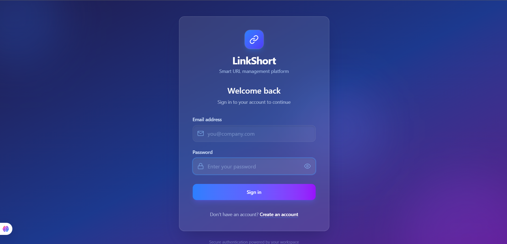
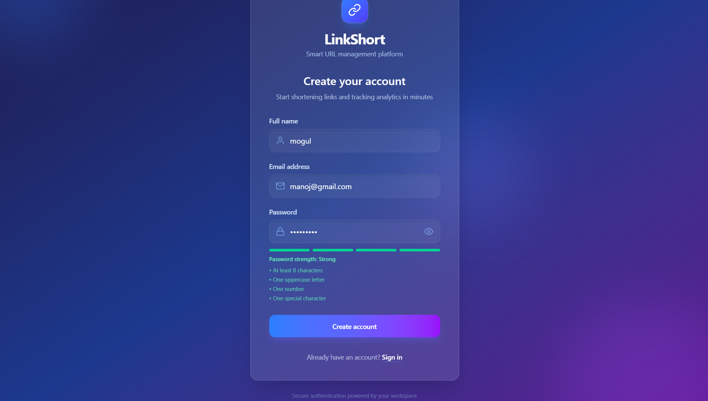
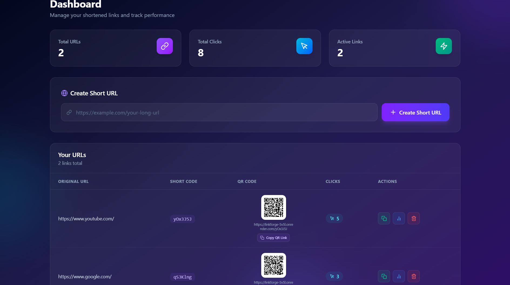
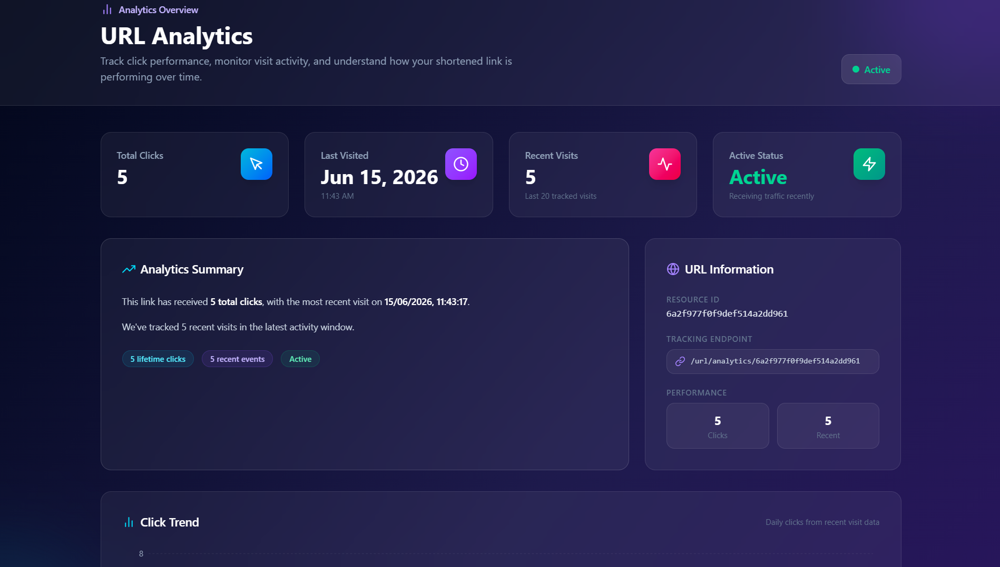
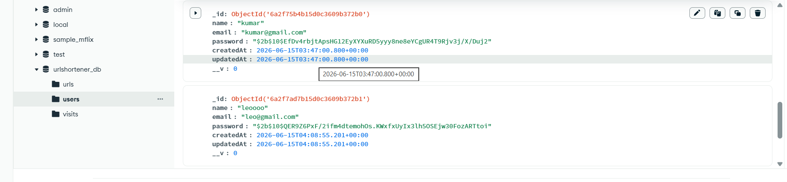
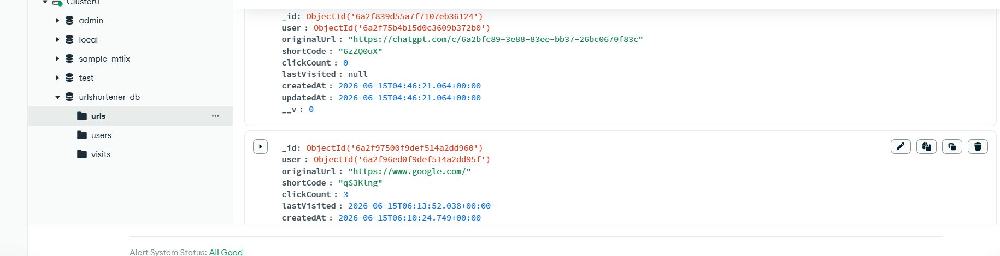
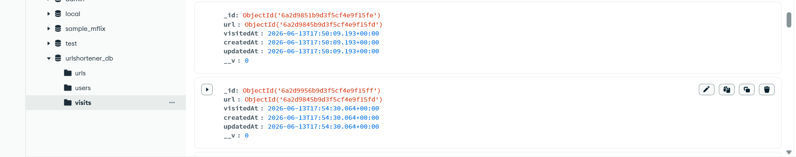

# 🔗 LinkForge - URL Shortener with Analytics


A modern full-stack URL Shortener application built using **React, Node.js, Express.js, and MongoDB Atlas**. 
The application allows authenticated users to generate shortened URLs, manage them through a responsive dashboard, and track analytics such as click count, last visited time, and visit history.

---

# 🚀 Live Demo

### Frontend (Vercel)

https://linkforge-opal.vercel.app/

### Backend (Render)

https://linkforge-5v5l.onrender.com/

---

# 🎥 Demo Video

**YouTube**

[▶️ Watch Demo Video](https://www.youtube.com/watch?v=U2hQbl4VcVY)

---

# 📌 Project Overview

LinkForge enables users to securely shorten long URLs and monitor their performance using built-in analytics. Every registered user has a personal dashboard to create, manage, copy, and delete shortened links.

The application follows a modular full-stack architecture with secure authentication, REST APIs, server-side redirection, and MongoDB-based analytics tracking.

---

# ✨ Features

## Authentication

* User Registration
* User Login
* JWT Authentication
* Password Hashing using bcrypt
* Protected Dashboard Routes
* User-specific URL Management

---

## URL Shortening

* Generate unique short URLs
* Validate original URLs before shortening
* Server-side redirect handling
* Copy shortened URL
* Delete shortened URL

---

## Dashboard

* View all created URLs
* Display Original URL
* Display Short URL
* Display Created Date
* Display Total Clicks
* QR Code for every URL
* Copy URL Button
* Delete URL Button

---

## Analytics

Each shortened URL provides:

* Total Click Count
* Last Visited Time
* Recent Visit History
* Analytics stored in MongoDB

---

## User Interface

* Responsive Design
* Modern Dashboard
* Attractive Login & Register Pages
* Toast Notifications
* Loading and Error Handling

---

# 🛠️ Technology Stack

## Frontend

* React.js
* Vite
* Tailwind CSS
* React Router DOM
* Axios
* React Toastify
* QR Code Generator

## Backend

* Node.js
* Express.js
* JWT Authentication
* bcryptjs
* Validator
* NanoID

## Database

* MongoDB Atlas
* Mongoose

## Deployment

* Frontend: Vercel
* Backend: Render

---

# 📂 Project Structure

```text
LinkForge/

├── backend/
│   ├── config/
│   ├── controllers/
│   ├── middleware/
│   ├── models/
│   ├── routes/
│   ├── utils/
│   ├── server.js
│   └── package.json
│
├── frontend/
│   ├── public/
│   ├── src/
│   │   ├── components/
│   │   ├── pages/
│   │   ├── services/
│   │   └── App.jsx
│   ├── package.json
│   └── vercel.json
│
└── README.md
```

---

# 📋 Setup Instructions

## Clone Repository

```bash
git clone https://github.com/Mogul77/linkforge.git

cd linkforge
```

---

## Backend Setup

```bash
cd backend

npm install
```

Create a `.env` file inside the backend folder.

```env
PORT=5000

MONGO_URI=YOUR_MONGODB_URI

JWT_SECRET=YOUR_SECRET_KEY
```

Run Backend

```bash
npm run dev
```

---

## Frontend Setup

```bash
cd frontend

npm install
```

Create a `.env` file inside the frontend folder.

```env
VITE_API_URL=http://localhost:5000/api

VITE_BACKEND_URL=http://localhost:5000
```

Run Frontend

```bash
npm run dev
```

---

# 🔐 Environment Variables

## Backend

* PORT
* MONGO_URI
* JWT_SECRET

## Frontend

* VITE_API_URL
* VITE_BACKEND_URL

---

# 📊 REST API Endpoints

## Authentication

POST /api/auth/register

POST /api/auth/login

---

## URL

POST /api/url/create

GET /api/url/all

DELETE /api/url/:id

GET /api/url/analytics/:id

GET /:shortCode

---

# 🤖 AI Planning Document

## Planning Phase

The application was developed using an AI-assisted workflow while ensuring complete understanding of every generated module.

### Step 1 – Requirement Analysis

* Studied the hackathon problem statement.
* Identified mandatory and bonus features.
* Planned backend and frontend architecture.

### Step 2 – Backend Development

* Designed MongoDB models.
* Implemented authentication.
* Built REST APIs.
* Added JWT middleware.
* Implemented URL shortening logic.
* Implemented redirect functionality.
* Stored analytics in MongoDB.

### Step 3 – Frontend Development

* Designed responsive UI.
* Built Login and Register pages.
* Developed Dashboard.
* Implemented Analytics page.
* Added Copy URL functionality.
* Integrated QR Code generation.
* Added loading, success, and error states.

### Step 4 – Deployment

* Backend deployed on Render.
* Frontend deployed on Vercel.
* MongoDB Atlas configured.
* Environment variables secured.

---

# 📑 Features Implemented

* User Authentication
* JWT Security
* Password Hashing
* Protected Routes
* URL Validation
* URL Shortening
* URL Redirection
* QR Code Generation
* Click Tracking
* Visit History
* Analytics Dashboard
* Copy URL
* Delete URL
* Responsive UI
* Cloud Deployment

---

# 🏗️ Architecture Diagram

```text
                   User

                     │

                     ▼

      React Frontend (Vercel)

                     │

              Axios REST API

                     │

                     ▼

      Node.js + Express (Render)

                     │

           JWT Authentication

                     │

                     ▼

            MongoDB Atlas Database
```

---

# 💡 Assumptions

* Every generated short code is unique.
* Users can only access their own URLs.
* Analytics are recorded after every successful redirect.
* MongoDB Atlas stores application data.
* Sensitive credentials are stored using environment variables.
* Passwords are securely hashed before storage.

---

# 📸 Sample Output

Include the following in your GitHub repository or demo video:

* Login Page  :           
* Register Page :         
* Dashboard Screenshot :  
* Analytics Screenshot :  
* MongoDB Collections :

  * users  
  * urls   
  * visits 

---

# 🚀 Future Enhancements

* Custom Alias
* URL Expiry
* Device Analytics
* Browser Analytics
* Geolocation Tracking
* Click Trend Charts
* Public Statistics Page
* Bulk URL Shortening
* Edit Destination URL

---

# 👨‍💻 Author

**Mogul Manoj M**

Computer Science Engineering Student

---

# 🙏 Acknowledgement

This project was developed using AI-assisted development tools for code generation, planning, debugging, UI enhancement, and deployment guidance. All generated code was reviewed, understood, integrated, and tested before deployment.

---

## Hackathon Submission

This project is a part of a hackathon run by https://katomaran.com
